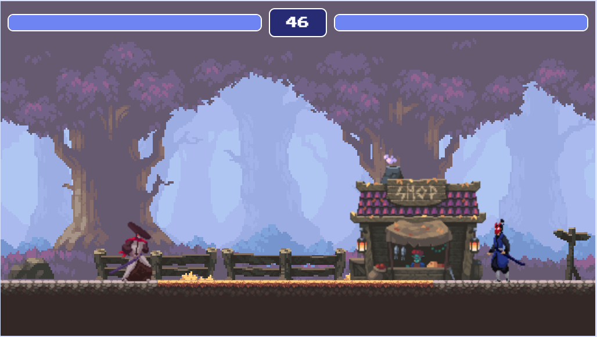

# 2d fighter

A 2d fighter game written in Typescript and sass using html canvas.



## Install dependencies

- [typescript](https://www.typescriptlang.org/download)
- [sass](https://sass-lang.com/install)
- [honcho](https://pypi.org/project/honcho/)
- [serve](https://github.com/vercel/serve)

if you already have npm and pip installed you can run the following:

```bash
    npm i -g typescript sass serve
    pip install honcho
```

## Develop

```
    sh dev.sh
```

Server runs on port `3000`

## Build

```
    sh build.sh
    serve
```

Server runs on port `5200`. Alternatively choose your own port by passing `-p` e.g `serve -p 5200`
